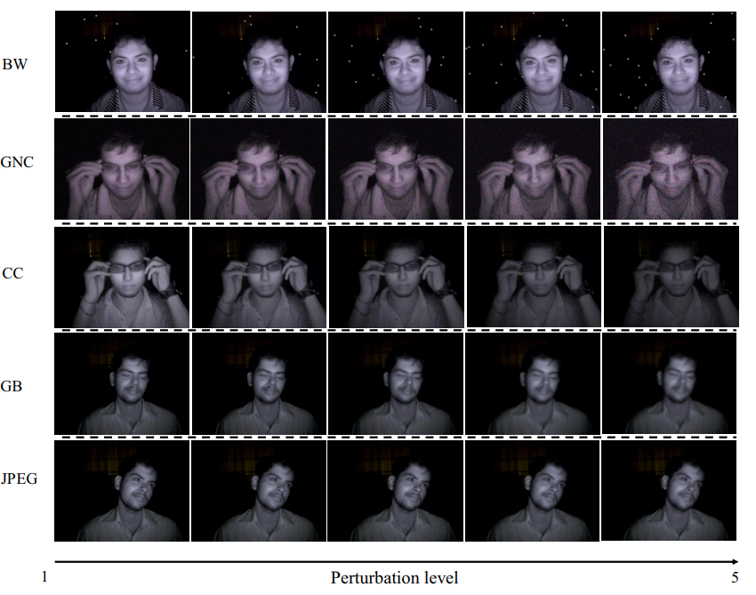

# Spatial-Temporal Frequency Forgery Clue for Video Forgery Detection in VIS and NIR Scenario

##  Abstact
   In recent years, with the rapid development of face editing and generation, more and more fake videos are circulating on social media, which has caused extreme public concerns. Existing face forgery detection methods based on frequency domain find that the GAN forged images have obvious grid-like visual artifacts in the frequency spectrum. But for synthesized videos, these methods only confine to a single frame and pay little attention to the most discriminative part and temporal frequency clue among different frames. To take full advantage of the rich information in video sequences, this paper performs video forgery detection on both spatial and temporal frequency domains and proposes a Discrete Cosine Transform-based Forgery Clue Augmentation Network (FCAN-DCT) to achieve a more comprehensive spatial-temporal feature representation. FCAN-DCT totally consists of a backbone network and two branches: Compact Feature Extraction (CFE) module  and Frequency Temporal Attention (FTA) module. We conduct thorough experimental assessments on three visible light (VIS) based datasets FaceForensics++, Celeb-DF (v2), WildDeepfake, and our self-built video forgery dataset **DeepfakeNIR**, which is the first video forgery dataset on near-infrared (NIR) modality. The experimental results demonstrate the effectiveness and robustness of our method for detecting forgery videos in both VIS and NIR scenarios.

## Introduction
   **Previous datasets**
   
   |       Dataset name       |         Download         |Generate method|      Deepfake videos     | 
   |--------------------------|--------------------------|----|--------------------------|
   |   Faceforensics++        |[download](https://github.com/ondyari/FaceForensics)|Deepfake|1000|
   |Celeb-DF v1|[download](https://github.com/danmohaha/celeb-deepfakeforensics)|Deepfake|795|
   |Celeb-DF v2|[download](https://github.com/danmohaha/celeb-deepfakeforensics)|Deepfake|590|
   |   WildDeepfake   |[download](https://github.com/deepfakeinthewild/deepfake-in-the-wild#download)|Internet|
   
   **Ours**
   
   |       Dataset name       |         Download         |Generate method|      Deepfake videos     | 
   |--------------------------|--------------------------|----|--------------------------|
   |   **DeepfakeNIR**   |[**download(copq)**](https://pan.baidu.com/s/1riKmooLu19ikZG1VsUJOJg)|**Deepfacelab**|**1908**|

**File Structure**:
~~~
DeepfakeNIR

            |--1-10.zip
                |--sub1_11
                    |--001.mp4
                    |--002.mp4
                    |--003.mp4
                    ...
                |--sub2_12
                    |--001.mp4
                    |--002.mp4
                    |--003.mp4
                    ...
                ...
            |--11-20.zip
                |--sub11_21
                    |--001.mp4
                    |--002.mp4
                    |--003.mp4
                    ...
                |--sub12_22
                    |--001.mp4
                    |--002.mp4
                    |--003.mp4
                    ...
                ...
            
            ...

            |--51-60.zip
                |--sub51_1
                    |--001.mp4
                    |--002.mp4
                    |--003.mp4
                    ...
                |--sub52_2
                    |--001.mp4
                    |--002.mp4
                    |--003.mp4
                    ...
                ...

~~~

In each zip file, there will be several folders containing NIR forgery videos, and the videos in each folder `sub_a_b` represent the replacement of the face with identity `a` on the target identity `b`.

## Details
DeepfakeNIR contains 3,847 videos in total. Specifically, the detailed construction process is as follows: first, we divide the  59 videos of NIR videos collected from Near Infrared Face Database [1] into six groups, (e.g. 1-10, 11-20, 21-30, 31-40, 41-50, 51-60). It is worth noting that since the author did not provide the 15th video, so we get a total of 59 videos; Then, we use the 10 video identities of the former group to replace the corresponding videos in the latter using deepfacelab tool, and we get a total of {58} fake videos; Eventually, we divided these videos into 1,939 real and  1,908 fake videos in terms of posture, occultation, and expression. Examples are shown in Fig. 1. Furthermore, we apply various perturbations such as local block-wise distortion (BW), white Gaussian noise in color (GNC), color contrast change (CC), gaussian blur (GB) and JPEG compression (JPEG),  \textit{etc}. to better mimic videos in real-world scenarios. Specifically, we divide each of these perturbations into five intensity levels. Then, we randomly select the five types of perturbation and intensity with equal probability and finally generate corresponding 1,939 real and 1,908 fake perturbated videos. The ratio of five perturbation types applied in the dataset is roughly 1:1:1:1:1.

[1] S L Happy, A. Dasgupta, A. George and A. Routray, “A Video Database of Human Faces under Nea Infra-Red Illumination for Human Computer Interaction Applications,” in IEEE Proceedings of 4th International Conference on Intelligent Human Computer Interaction, Kharagpur, India, 2012.

</img>

   
   Fig. 1. Example frames in DeepfakeNIR with a diverse perturbations in terms of local block-wise distortion (BW), white Gaussian noise in color (GNC), color contrast change (CC), gaussian blur (GB) and jpeg compression (JPEG).

## Download
You can download [here(copq)](https://pan.baidu.com/s/1riKmooLu19ikZG1VsUJOJg). We support Baidu drive.
